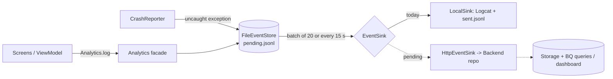

# Sprint Deliverable – Android app (Kotlin / Jetpack Compose)

Scope of this document: what is implemented in the Android repo. The backend lives in a separate repo, so the server half of the analytics pipeline is marked as pending.

## 1. Business Questions (BQs) implemented

The client records the events each BQ needs. Answering a BQ (query or chart) needs the backend storage, which is pending. Owners must be filled in by each member.

| # | Business Question | Type | Owner | Events logged by the app | Rationale |
|:-:|---|:-:|---|---|---|
| 1 | Screens/features where crashes happen most, by OS version and device model | 1 | _member_ | `crash` (exception, top stack frame, screen, `osVersion`, `deviceModel`) | Tells the team where to debug first and which devices to test. |
| 2 | Listings a buyer opens before contacting a seller / completing an exchange | 2 | _member_ | `listing_opened`, `chat_message_sent`, `purchase_completed` | If the number is high, search and comparison are not giving enough information at first sight. |
| 3 | Photos sellers upload and how that relates to buyer contacts | 2 | _member_ | `listing_published.photo_count`, `chat_message_sent` (partial: no photo-angle labeling yet) | Supports a photo checklist if more photos means more contacts. |
| 4 | Messages and time between buyer and seller before agreeing a meeting point | 2 | _member_ | `chat_message_sent`, `meeting_proposed` and `meeting_confirmed` (both with `messages_in_thread`, `elapsed_ms`) | A high count means the listing lacks information. |
| 5 | Time of day and weekday of publishing and browsing | 2 | _member_ | Every event carries a timestamp; `screen_view`, `search_performed`, `listing_published` | Lets notifications arrive when students are free. |
| 6 | Categories with the most listings and completed exchanges | 3 | _member_ | `listing_published.category`, `listing_opened.category`, `purchase_completed.category` | Shows which categories to merge or specialise. |
| 7 | Wishlist saves that end in a purchase after a Smart Matching notification | 3 | _member_ | `wishlist_toggled`, `alert_created`, `match_notified`, `purchase_completed.after_match_notification` | Shows whether Smart Matching converts or is noise. |
| 8 | Listing-form fields sellers leave empty | 3 | _member_ | `listing_published` (`course_empty`, `condition_empty`, `description_length`) | Empty fields break filters; decide required, optional or automatic. |
| 9 | Price variation of the same item across sellers, faculties and condition | 4 | _member_ | `listing_published` (`price`, `category`); condition and course to be added | Feeds the AI price estimation. |
| 10 | Listings published but never sold, and what they share | 4 | _member_ | Not covered yet: needs a sold/archived event | Warns sellers or suggests a price drop. |

## 2. Analytics pipeline (client half implemented)

Rationale: events are written to disk first, then shipped in batches. Nothing is lost when the phone is offline (campus Wi-Fi) or the app crashes, and a rejected batch stays queued for the next attempt. The sink is an interface, so connecting the backend is one new class and no change to the screens. Dashed arrows are the parts that belong to the backend repo.

## 3. Architectural design (text)

**Architecture.** One Android module and a single Activity. The UI is Jetpack Compose with Navigation Compose (15 routes, bottom bar with five destinations). A shared `AppViewModel` holds app state as Compose snapshot state, and `SampleData` provides in-memory data. There is no backend yet.

**Interaction.** Screens observe ViewModel state and call its functions (unidirectional data flow). The ViewModel and navigation log through the `Analytics` facade. The facade persists to `FileEventStore`, and `EventQueue` hands batches to the `EventSink`.

**Patterns and tactics implemented**

| Pattern / tactic | Where | Responsible |
|---|---|---|
| Facade / Observer (single logging entry point) | `analytics/Analytics.kt` | _Daniel Diab_ |
| Strategy (swappable `EventSink`) | `analytics/EventSink.kt` | _Daniel Diab_ |
| Tactic: persistent queue + batching (availability offline) | `analytics/EventQueue.kt` | _Daniel Diab_ |
| Tactic: crash monitoring | `analytics/CrashReporter.kt` | _Daniel Diab_ |
| MVVM with unidirectional data flow, state hoisting | `AppViewModel`, screens | Team |
| Single-Activity navigation graph | `navigation/` | Team |

Each remaining member must add one tactic and one pattern here (see the team message).

## 4. Implemented features

| Feature | Screens | Responsible |
|---|---|---|
| Login, home, search with filters, product detail, 4-step sell flow, seller profile, bottom navigation, light/dark theme | `screens/auth`, `home`, `search`, `product`, `sell`, `profile`, `navigation`, `ui/theme` | Daniel Diab |
| In-app chat with message status; meeting-point and time-slot proposal | `screens/chat`, `screens/meeting` (Views 09, 10) | Carla González |
| Smart alerts and match notifications; exchange completion and mutual rating | `screens/home/AlertsScreen`, `screens/rating` (Views 11, 12) | Santiago Bernal |
| Cart, checkout, order confirmation | `screens/cart` | Santiago Bernal (confirm) |
| Wishlist, notifications | `screens/home` | Team |
| Analytics tracking, offline event queue, crash reporting, unit tests | `analytics/`, `src/test` | Daniel Diab |

Owners are taken from git history; correct them before submitting.
